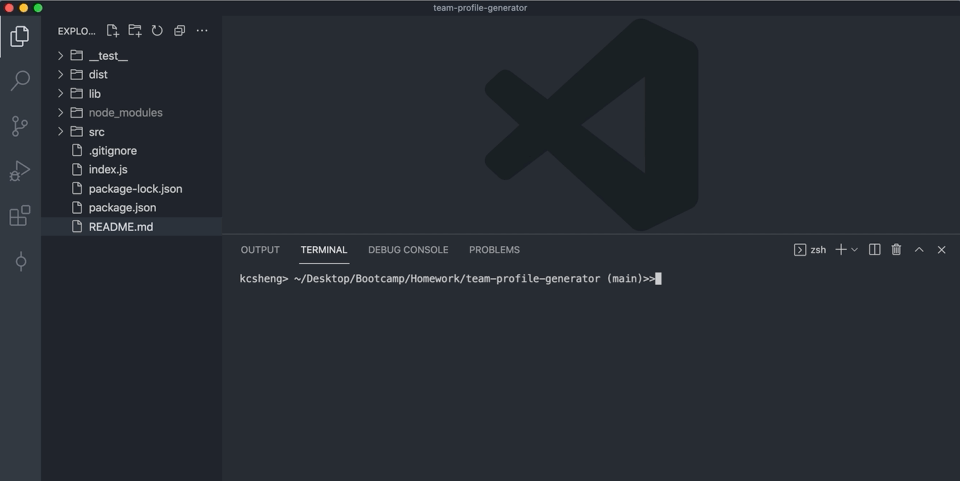
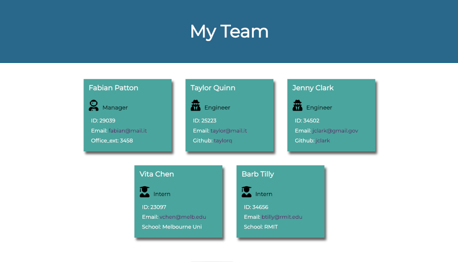

<h1>Team Profile Generator</h1>

<h2>Description</h2>

This App can generate a summary profile of a software engineering team based on member's role. The CLI input interface is built upon npm package [inquirer](https://www.npmjs.com/package/inquirer). The app is constructed following OOP and TDD practices.

<h2>Table of Contents</h2>
<ul> 
  <li><a href="#requirement">Features</a></li>
  <li><a href="#plan">Development plan</a></li>
  <li><a href="#install">Installation</a></li>
  <li><a href="#license">License</a></li>
  <li><a href="#demo">Demo</a></li>
</ul>
<h2 id="requirement">App features</h2>

- Ability to build a team profile (manager, engineer(s) and intern(s)) based on CLI prompts
- Ability to show entire team profile and contact information in html immediately after the build

<h2 id="plan">Development plan</h2>
This app is contructed based on OOP. Five classes including employee, manager, engineer, intern and team are used to create instances based on user input. Classes are built incrementally along with TDD using Jest. To unit-test the actual user input which is subsequently used by the receiving function, I will need to mock the external dependency inquirer to simulate the data flow. Functions/classes are established incrementally with the corresponding tests. Once passing the tests, the code must be refactored without breaking the app.

<h2 id="install">Installation</h2>
The entire App can be downloaded using git clone or zip method. Please run npm install to restore necessary node modules.

<h2 id="license">License</h2>

[MIT](https://opensource.org/licenses/MIT)

<h2 id="demo">Demo</h2>

- App demo - click [here](./dist/assets/img/demo.gif) to restart app demo in a separate window.
  
- Test demo - Click [here](./dist/assets/img/demo_test.gif) to restart test demo in a separate window.
  

- HTML result sample
  
